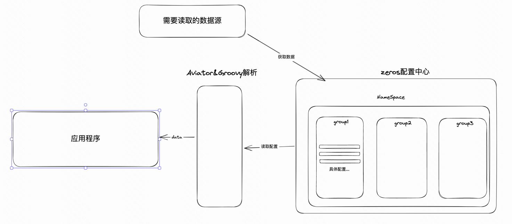

## Zeros配置中心

愿景想通过aviator、groovy表达式的方式读取配置中心，实现脚本化

##### 工具
- 画图软件：https://excalidraw.com/

- 整体大致工作流程图
- 

#### groovy方式获取json的某个key
- value的具体值 其中 `out_settle_param = value`, 下面json数据就是value的值
```json
{
  "settle_params":[
    {
      "seller_account_id":"1573069417",
      "account_group_key":"MERCHANT_SELLER",
      "amount":4500,
      "receiver_params_post_position":true,
      "goods_infos":[
        {
          "goods_name":"闪电购女装53",
          "goods_category":"T恤",
          "goods_unit_price":4500,
          "goods_quantity":1,
          "goods_type":"PHY",
          "goods_id":"15508048965417"
        }
      ]
    }
  ],
  "need_merge_pay":false
}
```

- 配置中心配置
```json
{
  "key": "out_settle_param",
  "script:": "json().parseText(out_settle_param)?.settle_params.collect{it.seller_account_id}"
}
```
- 语法
这样就就可以通过配置中心读取脚本配置，获取我们想要的值，目前支持aviator&groovy两种脚本
```java
String key = conf.getKey();
String script = conf.getScript();
List<Object> res = scriptValueList(key, script, jsonData, null);
res.forEach(item -> Assert.assertEquals(String.valueOf(item), "1573069417"));
```


### 配置安全性
可能会遇到用户配置错误导致整个应用挂掉的风险，所以我们需要一个fail-safe机制

<b>在构造器ZConfBuilder中构建：</b>
```java
public interface ZConfBuilder<T> {

    /**
     * mapper 的作用：
     *  1. 类型转换
     *  2. 合法性校验 mapper 实现的原则：
     *          1. Fail Fast，仔细校验格式，如果不合法直接抛出异常，框架层会自动返回上一个正确的值或者默认值
     *          2. 切忌把 mapper 当作变更回调向外产生副作用，如果 mapper 抛出异常，很容易产生状态不一致 如下配置方式，如果 ZConf 平台上配置了非法的正则，mapper 会抛出 PatternSyntaxException ZConf
     * 就会使用上一次的合法值或者默认值
     * ```java
     *  private final ZConf  patternZConf = ZConfs.ofString("team.biz.pattern", "baidu\\.com")
     *               .mapper(Pattern::compile)
     *               .build();
     * ```
     */
    public abstract <T2> ZConfBuilder<T2> mapper(ConfigMapper<T, T2> mapper);

    public ZConf<T> build();

}
```

核心在于ConfigMapper中error处理的实现
```java
public interface ConfigMapper<T, R> extends ThrowableFunction<T, R, Exception> {
    
}
```
`ThrowableFunction.java`
```java
@FunctionalInterface
public interface ThrowableFunction<T, R, X extends Throwable> {

    static <T, X extends Throwable> ThrowableFunction<T, T, X> identity() {
        return (t) -> t;
    }

    R apply(T t) throws X;

    default <V> ThrowableFunction<V, R, X> compose(ThrowableFunction<? super V, ? extends T, X> function) {
        Objects.requireNonNull(function);
        return (v) -> this.apply(function.apply(v));
    }

    default <V> ThrowableFunction<T, V, X> after(ThrowableFunction<? super R, ? extends V, X> function) {
        Objects.requireNonNull(function);
        return (t) -> function.apply(this.apply(t));
    }
}
```
通过ZConf兜底，防止配置错误程序宕掉

### 新手开发教程
通过key读取到当前namespace的string值，然后初始化返回
```java
ZConf<Pattern> conf = ZConfs.ofString("/tmp/tr", "www.baidu.com")
                .mapper(Pattern::compile)
                .build();
```

